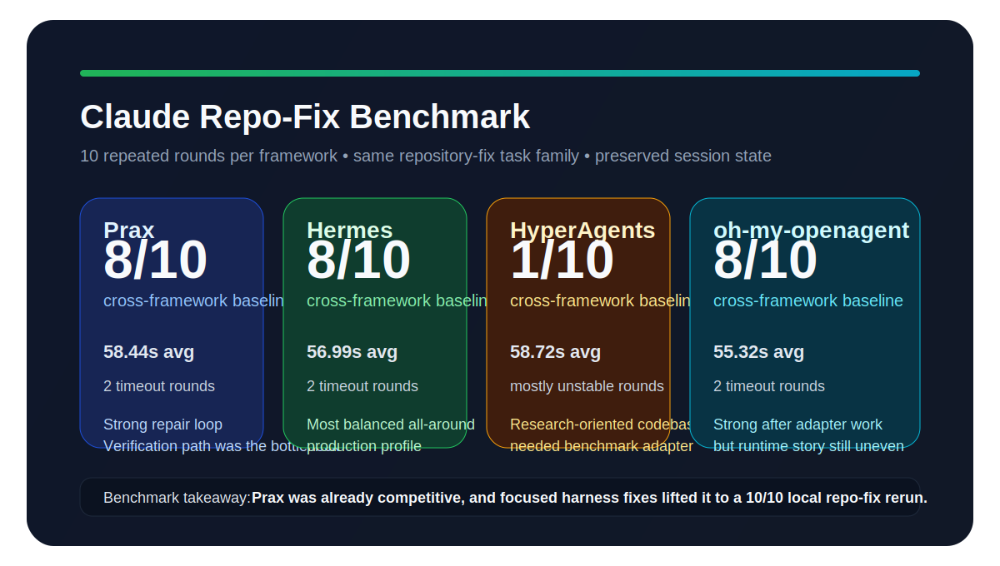
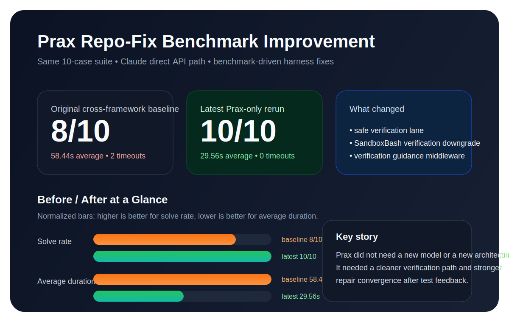

<div align="center">

# Prax

**CLI tool that drives LLM agents through test-verify-fix loops on real codebases**

<br>

[](LICENSE)
[](https://www.python.org/downloads/)

[Quick Start](#quick-start) · [Why Prax](#why-prax) · [Usage](#usage-examples) · [Results](#results) · [Configuration](#configuration) · [Architecture](#architecture) · [Contributing](#contributing)

<br>

</div>

---

## Quick Start

```bash
git clone https://github.com/ChanningLua/prax-agent.git
cd prax
pip install -e .

export ANTHROPIC_API_KEY=your_key_here

# Run a task with the native runtime
prax --runtime-path native "run pytest -q, fix the failure, and stop when tests pass"
```

Prax inspects your codebase, runs checks, edits files, and verifies the result in a loop. It keeps context across sessions so follow-up tasks pick up where you left off.

> Prax can execute shell commands on your behalf. It defaults to `workspace-write` mode — files outside the project are off-limits. Use `--permission-mode read-only` for safe exploration.

By default, `prax` runs in `auto` mode:

- if the `claude` binary is available, Prax uses the Claude CLI bridge
- otherwise it uses the native runtime

For reproducible debugging and benchmarking, pin `--runtime-path native`.

---

## Why Prax

**Prax isn't just another LLM wrapper — it's a production-grade agent runtime built for real repository work.**

### Verification-First Architecture

<p align="center">
  
</p>

Most tools send a prompt and hope for the best. Prax runs a **test-verify-fix loop**: it executes your test suite, analyzes failures, edits code, and re-runs until tests pass. The verification layer is first-class — not an afterthought.

**Benchmark-proven**: 10/10 repository repair tasks solved in 29.56s average (vs 8/10 baseline across peer frameworks).

### Persistent Memory Across Sessions
Context doesn't vanish when you close the terminal. Prax stores decisions, architectural insights, and project facts locally. Follow-up tasks pick up where you left off — no need to re-explain your codebase every time.

**Three memory backends**: JSON (zero-config), SQLite (full-text search), OpenViking (vector embeddings).

### Multi-Model Orchestration
Not locked into one provider. Prax supports **Claude, GPT, GLM, and custom models** with explicit routing, fallback chains, and cost tracking. Switch models mid-session with `/model claude-opus-4-6`.

### Security by Design
- **Permission modes**: `read-only`, `workspace-write`, `danger-full-access` — you control what the agent can touch
- **Schema validation**: All tool inputs validated before execution
- **Workspace boundaries**: File operations blocked outside project root by default
- **Audit trail**: Full session logs for every action

### Built for Real Codebases
- **25+ built-in tools**: Read, Edit, Grep, Bash, Git, VerifyCommand, and more
- **Middleware pipeline**: Loop detection, quality gates, verification guidance
- **Multi-language support**: Python, JavaScript, Rust, Go — if it has tests, Prax can fix it
- **REPL mode**: Interactive debugging with slash commands (`/plan`, `/cost`, `/session list`)

### Transparent & Measurable
- Real-time cost tracking (`/cost`)
- Session history and replay
- Benchmark suite included (see [docs/BENCHMARKS.md](./docs/BENCHMARKS.md))
- Open architecture — extend with custom agents, tools, and middleware

---

## Usage Examples

### Repository Repair

```
$ prax "run pytest -q, fix the failure, and stop when tests pass"
▶ VerifyCommand {"command": "pytest -q"}
  ✗ FAILED test_auth.py::test_login - AssertionError
▶ Read {"file_path": "src/auth.py"}
▶ Edit {"file_path": "src/auth.py", ...}
▶ VerifyCommand {"command": "pytest -q"}
  ✓ 1 passed in 0.12s
Verification passed. Task complete.
```

### One-off Tasks

```bash
prax "explain the authentication flow in login.py"
prax "refactor auth.py error handling, replace requests with httpx"
prax "analyze project architecture, list technical debt, prioritize by impact"
```

### Interactive REPL

```bash
prax repl

> analyze the codebase structure
> fix the SQL injection in user_query.py
> /model claude-opus-4-6
> /cost
Session: 12.4K tokens ($0.04)
```

### Slash Commands

```
/model, /session list, /plan, /todo show, /doctor, /cost, /help
```

---

## Results



Internal benchmark against Hermes, HyperAgents, and oh-my-openagent on a Claude-family repository-repair suite:

| Run | Solved | Avg Time |
|---|---:|---:|
| Cross-framework baseline | `8/10` | `58.44s` |
| Latest Prax-only rerun | `10/10` | `29.56s` |

Each framework ran 10 repeated rounds on real repository-fix tasks with session state preserved.



The improvement came from verification and convergence fixes in the agent loop, not from changing the benchmark task. This measures repository-repair only — not open-domain research or multi-hour planning.

See [docs/BENCHMARKS.md](./docs/BENCHMARKS.md) for methodology and raw data.

---

## Configuration

**Models** — create `.prax/models.yaml` in your project:

```yaml
default_model: claude-sonnet-4-6

providers:
  anthropic:
    base_url: https://api.anthropic.com
    api_key_env: ANTHROPIC_API_KEY
    format: anthropic
    models:
      - name: claude-sonnet-4-6

  openai:
    base_url: https://api.openai.com/v1
    api_key_env: OPENAI_API_KEY
    format: openai
    models:
      - name: gpt-4.1
```

Or: `prax /init-models claude`

**Permission modes**

| Mode | What it allows | Default |
|------|---------------|---------|
| `read-only` | No file writes, no shell commands | |
| `workspace-write` | Modify files inside the project | ✓ |
| `danger-full-access` | Unrestricted | |

```bash
prax --permission-mode read-only "analyze security vulnerabilities"
```

**Runtime paths**

| Flag | Behavior |
|------|----------|
| `--runtime-path auto` | Uses Claude CLI bridge if `claude` is installed, otherwise native runtime (default) |
| `--runtime-path native` | Always use the native runtime |
| `--runtime-path bridge` | Always use the Claude CLI bridge; fails if `claude` is not installed |

**Data directory**

| Path | Content |
|------|---------|
| `.prax/sessions/` | Conversation history |
| `.prax/memory.json` | Project memory (auto-extracted facts) |
| `.prax/todos.json` | Current task list |
| `.prax/agents/` | Custom agent definitions |
| `.prax/models.yaml` | Model configuration |
| `~/.prax/` | Global config (cross-project) |

---

## Architecture

<p align="center">
  
</p>

Key modules:

| Path | Role |
|------|------|
| `core/agent_loop.py` | Core orchestration cycle (25 iter max, circuit breaker) |
| `core/middleware.py` | VerificationGuidance, LoopDetection, QualityGate, etc. |
| `tools/verify_command.py` | Bounded verification (pytest, npm test, cargo test, go test) |
| `tools/sandbox_bash.py` | Auto-downgrade: verify commands bypass sandbox overhead |
| `core/memory/` | Pluggable backends (local / SQLite / vector) |
| `core/llm_client.py` | Provider registry, multi-model routing |
| `agents/` | Ralph (planner), Sisyphus (executor), Team (parallel) |
| `workflows/` | Task decomposition and orchestration |

---

## Contributing

We welcome contributions! See [CONTRIBUTING.md](CONTRIBUTING.md) for:
- Development setup
- Code style guidelines
- Testing requirements
- PR process

For benchmark and reproducibility work, also see [docs/BENCHMARKS.md](./docs/BENCHMARKS.md).

---

## License

MIT License — see [LICENSE](LICENSE) for details.
