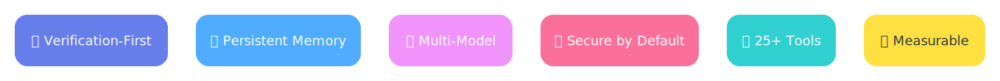

<div align="center">

# Prax

**Self-improving agent runtime that learns from experience and drives LLM agents through test-verify-fix loops**

<br>

[](LICENSE)
[](https://www.python.org/downloads/)

[Quick Start](#quick-start) · [Why Prax](#why-prax) · [Usage](#usage-examples) · [Results](#results) · [Integration Paths](#integration-paths) · [Configuration](#configuration) · [Architecture](#architecture) · [Contributing](#contributing)

<br>

</div>

---

## Quick Start

```bash
git clone https://github.com/ChanningLua/prax-agent.git
cd prax
pip install -e .

export ANTHROPIC_API_KEY=your_key_here

# Run a task with the native runtime
prax --runtime-path native "run pytest -q, fix the failure, and stop when tests pass"

# Or use with Claude Code integration
prax /init-models claude
# Then open your project in Claude Code and use /prax commands
```

Prax inspects your codebase, runs checks, edits files, and verifies the result in a loop. It keeps context across sessions so follow-up tasks pick up where you left off.

> Prax can execute shell commands on your behalf. It defaults to `workspace-write` mode — files outside the project are off-limits. Use `--permission-mode read-only` for safe exploration.

---

## Why Prax

**Prax isn't just another LLM wrapper — it's a production-grade agent runtime built for real repository work.**

<p align="center">
  
</p>

### Experience-Based Self-Improvement

Prax learns from experience and self-improves across sessions and projects:

- **Correction Detection** — Automatically detects when users correct mistakes, extracts problem-solution patterns, and applies them in future sessions (multilingual support)
- **Cross-Project Experience Accumulation** — Builds a global experience store at `~/.prax/experiences.json` that improves performance across all your repositories
- **Structured Error Recovery** — Blacklists failing approaches and tries alternatives, preventing repeated mistakes within the same session
- **Persistent Memory with Confidence Scoring** — Two backends (JSON/SQLite) track context, decisions, and learned patterns with decay over time
- **Temporal Knowledge Graph** — Tracks entity relationships and their evolution across sessions
- **Checkpoint/Resume** — Crash recovery ensures no work is lost, even during long-running tasks
- **Trajectory Recording** — Learns from execution history to identify successful patterns and avoid failure modes

These capabilities are production-ready and integrated into the core runtime — not experimental plugins.

### Working with Experience & Memory

Prax automatically learns from your work and applies that knowledge to future tasks. Here's how to work with its memory system:

#### Automatic Learning

Prax captures experience in these situations:

- **Correction Detection** — When you correct a mistake (e.g., "that's wrong", "不对", "try again"), Prax extracts the problem-solution pattern and saves it to `.prax/solutions/`
- **Task Completion** — Facts with confidence ≥ 0.7 are persisted to project memory
- **Tool Failures** — Failed approaches are blacklisted within the session to avoid repetition
- **Verification Success** — Successful test-fix patterns are recorded as experiences
- **Session End** — Context snapshots are saved for the next session to resume

#### Viewing Memory

Check what Prax has learned:

```bash
# Project-specific memory
cat .prax/memory.json          # Facts and context (JSON backend)
cat .prax/memory.db            # Or SQLite backend
ls .prax/solutions/            # Problem-solution patterns

# Global cross-project experiences
cat ~/.prax/experiences.json   # Shared learnings (JSON backend)
cat ~/.prax/experiences.db     # Or SQLite backend

# Session history
ls .prax/sessions/             # Past conversation transcripts
```

#### Managing Memory

Clean up memory when needed:

```bash
# Clear project memory
rm -rf .prax/memory.json .prax/solutions/

# Clear global experiences
rm -rf ~/.prax/experiences.json

# Clear session history
rm -rf .prax/sessions/

# Full reset
rm -rf .prax/ ~/.prax/
```

#### Memory Backends

Prax supports two memory backends:

| Backend | Storage | Best For | Search |
|---------|---------|----------|--------|
| **local** (JSON) | `.prax/memory.json` + `~/.prax/experiences.json` | Zero-config, small projects | Linear scan |
| **sqlite** | `.prax/memory.db` + `~/.prax/experiences.db` | Medium to large projects, full-text search | FTS5 index |

Configure in `.prax/config.yaml`:

```yaml
memory:
  backend: local  # or sqlite
  local:
    max_facts: 100
    fact_confidence_threshold: 0.7
    max_experiences: 500
```

#### Confidence & Decay

- Facts with confidence ≥ **0.7** are persisted to memory
- Lower-confidence observations are kept in session context only
- Confidence scoring is static per fact (no time-based decay currently implemented)

### Verification-First Architecture

<p align="center">
  
</p>

Most tools send a prompt and hope for the best. Prax runs a **test-verify-fix loop**: it executes your test suite, analyzes failures, edits code, and re-runs until tests pass. The verification layer is first-class — not an afterthought.

**Benchmark-proven**: 10/10 repository repair tasks solved in 29.56s average (vs 8/10 baseline across peer frameworks).

**Dual Runtime Paths** — Native CLI for automation and CI/CD, Claude Code integration for interactive development. Choose the right tool for the job.

**Cross-Session Persistent Memory** — Context persists when you close the terminal. Two memory backends: JSON (zero-config) and SQLite (full-text search).

**Multi-Model Orchestration** — Claude, GPT, GLM, and custom models with explicit routing, fallback chains, and cost tracking. Switch models mid-session with `/model claude-opus-4-6`.

**Security by Design** — Permission modes (`read-only`, `workspace-write`, `danger-full-access`), schema validation, workspace boundaries, and full audit trail.

**Built for Real Codebases** — 25+ built-in tools, middleware pipeline (loop detection, quality gates), multi-language support, and interactive REPL mode.

**Transparent & Measurable** — Real-time cost tracking, session history and replay, benchmark suite included, open architecture for custom extensions.

---

## Usage Examples

### Repository Repair

```
$ prax "run pytest -q, fix the failure, and stop when tests pass"
▶ VerifyCommand {"command": "pytest -q"}
  ✗ FAILED test_auth.py::test_login - AssertionError
▶ Read {"file_path": "src/auth.py"}
▶ Edit {"file_path": "src/auth.py", ...}
▶ VerifyCommand {"command": "pytest -q"}
  ✓ 1 passed in 0.12s
Verification passed. Task complete.
```

### One-off Tasks

```bash
prax "explain the authentication flow in login.py"
prax "refactor auth.py error handling, replace requests with httpx"
prax "analyze project architecture, list technical debt, prioritize by impact"
```

### Interactive REPL

```bash
prax repl

> analyze the codebase structure
> fix the SQL injection in user_query.py
> /model claude-opus-4-6
> /cost
Session: 12.4K tokens ($0.04)
```

### Slash Commands

```
/model, /session list, /plan, /todo show, /doctor, /cost, /help
```

### Scheduled Tasks & Notifications (new in 0.4)

Prax can own scheduled work end-to-end. Declare channels in `.prax/notify.yaml`, jobs in `.prax/cron.yaml`, and `prax cron install` writes the system-level trigger for you (LaunchAgent on macOS, crontab line on Linux).

```bash
# 1. configure an outbound channel (Feishu / Lark / Email)
cat > .prax/notify.yaml <<YAML
channels:
  daily-digest:
    provider: feishu_webhook
    url: "\${FEISHU_WEBHOOK_URL}"
YAML

# 2. schedule a daily job
prax cron add \
  --name ai-news-daily \
  --schedule "0 17 * * *" \
  --prompt "触发 ai-news-daily 技能" \
  --notify-on failure \
  --notify-channel daily-digest

# 3. install the per-minute dispatcher
prax cron install
```

See [docs/recipes/ai-news-daily.md](./docs/recipes/ai-news-daily.md) for the full AI-news-automation recipe.

### Bundled Skills

Skills live under `skills/` (bundled) or `.prax/skills/` (project-local) and inject prompt guidance when their triggers match:

| Skill | Triggers | Purpose |
|---|---|---|
| `browser-scrape` | `抓取` `scrape` `twitter` `zhihu` `bilibili` `autocli` | Drive [AutoCLI](https://github.com/nashsu/AutoCLI) to scrape 55+ sites reusing the user's Chrome login |
| `knowledge-compile` | `整理` `compile` `wiki` `digest` `知识库` | Turn raw markdown into Obsidian-ready wiki (`index.md` + `topics/` + `daily-digest.md`) |
| `ai-news-daily` | `ai-news-daily` `daily digest` `日报` | End-to-end pipeline: scrape → compile → notify |
| `chinese-coding` | `中文` `注释` `文档` | Chinese comments/docs style guide |

Project-local skills in `.prax/skills/` override bundled ones with the same name.

### Commercial Use Cases (new in 0.4)

Four recipes tuned for team/enterprise workflows — designed to ship **reviewable artefacts** (not "AI said so" hallucinations) and to keep destructive actions firmly in human hands.

| Case | Target user | Prax differentiator | Recipe |
|---|---|---|---|
| **PR Triage Bot** | Eng lead | *Actually* checks out the PR branch and runs tests via `VerifyCommand`; compares against base. No GitHub side-effects. | [`docs/recipes/pr-triage.md`](./docs/recipes/pr-triage.md) |
| **Release Notes Generator** | Release manager | Reads git log + issue refs, groups by Conventional Commits into Keep-a-Changelog sections, idempotent per version. Writes files; never tags/pushes/publishes. | [`docs/recipes/release-notes.md`](./docs/recipes/release-notes.md) |
| **Docs Freshness Audit** | DevEx / tech writer | Diffs recently-changed source vs doc mentions, outputs an evidence-cited drift report. Never edits docs itself. | [`docs/recipes/docs-audit.md`](./docs/recipes/docs-audit.md) |
| **Support Ticket Digest** | PM / support lead | Zero external API calls; PII redaction runs before any LLM sees the data — compliance-grade local-only processing. | [`docs/recipes/support-digest.md`](./docs/recipes/support-digest.md) |

Each case is 10-minute deployable, works with the cron/notify plumbing above, and has hard contractual limits baked into its SKILL.md (no auto-approve, no auto-merge, no auto-refund, no auto-edit-docs) so the agent cannot drift.

---

## Results

<p align="center">
  
</p>

Prax achieves **10/10 success rate** on repository repair tasks, completing them in **29.56s average** — 49% faster than the cross-framework baseline.

| Metric | Prax | Framework Baseline | Improvement |
|--------|------|-------------------|-------------|
| Success Rate | **10/10** (100%) | 8/10 (80%) | **+25%** |
| Average Time | **29.56s** | 58.44s | **-49%** |
| Timeouts | **0** | 2 | **-100%** |

**What drives these results:**
- **Verification-First Architecture** — Test-verify-fix loops catch errors early
- **Quality Gate Middleware** — Loop detection and convergence guidance
- **Smart Sandbox Downgrade** — Verification commands bypass unnecessary overhead
- **Experience-Based Learning** — Correction detection, error pattern blacklisting, and cross-session memory accumulation

Benchmark methodology: 10 repeated rounds on real repository-fix tasks with session state preserved. See [docs/BENCHMARKS.md](./docs/BENCHMARKS.md) for full details.

---

## Integration Paths

Prax offers two runtime paths — choose the right tool for the job:

| Feature | Native Runtime | Claude Code Integration |
|---------|---------------|------------------------|
| Execution | CLI commands | Claude Code IDE |
| Interaction | Command-line REPL | IDE conversation interface |
| Context Management | Local JSON/SQLite | Claude Code sessions |
| Tool Integration | 25+ built-in tools | Claude Code tools + Prax extensions |
| Use Cases | Automation, CI/CD | Interactive development, code review |

### Claude Code Integration Advantages

- **IDE Native Experience** — Use Prax capabilities directly within Claude Code
- **Seamless Integration** — Deep integration via MCP servers and Hooks
- **Security Protection** — Pre-write secret scanning, pre-commit quality checks
- **Session Persistence** — Auto-save session state, resume from breakpoints
- **Bidirectional Collaboration** — Claude Code's conversational ability + Prax's verification loop

### Installation and Usage

```bash
# Install Claude Code integration
prax /init-models claude

# Diagnose installation status
prax /doctor claude

# Use in Claude Code
# 1. Open your project
# 2. Use /prax commands or direct conversation
# 3. Prax automatically runs test-verify-fix loops until completion
```

<p align="center">
  
</p>

---

## Configuration

**Models** — create `.prax/models.yaml` in your project:

```yaml
default_model: claude-sonnet-4-6

providers:
  anthropic:
    base_url: https://api.anthropic.com
    api_key_env: ANTHROPIC_API_KEY
    format: anthropic
    models:
      - name: claude-sonnet-4-6

  openai:
    base_url: https://api.openai.com/v1
    api_key_env: OPENAI_API_KEY
    format: openai
    models:
      - name: gpt-4.1
```

Or: `prax /init-models claude`

**Permission modes**

| Mode | What it allows | Default |
|------|---------------|---------|
| `read-only` | No file writes, no shell commands | |
| `workspace-write` | Modify files inside the project | ✓ |
| `danger-full-access` | Unrestricted | |

```bash
prax --permission-mode read-only "analyze security vulnerabilities"
```

**Runtime paths**

| Flag | Behavior |
|------|----------|
| `--runtime-path auto` | Uses Claude CLI bridge if `claude` is installed, otherwise native runtime (default) |
| `--runtime-path native` | Always use the native runtime |
| `--runtime-path bridge` | Always use the Claude CLI bridge; fails if `claude` is not installed |

**Data directory**

| Path | Content |
|------|---------|
| `.prax/sessions/` | Conversation history |
| `.prax/memory.json` | Project memory (auto-extracted facts, JSON backend) |
| `.prax/memory.db` | Project memory (SQLite backend) |
| `.prax/solutions/` | Problem-solution patterns from correction detection |
| `.prax/todos.json` | Current task list |
| `.prax/agents/` | Custom agent definitions |
| `.prax/models.yaml` | Model configuration |
| `.prax/config.yaml` | Project-level configuration (memory backend, etc.) |
| `~/.prax/` | Global config (cross-project) |
| `~/.prax/experiences.json` | Global cross-project experiences (JSON backend) |
| `~/.prax/experiences.db` | Global cross-project experiences (SQLite backend) |
| `~/.prax/config.yaml` | User-level configuration |

---

## Architecture

<p align="center">
  
</p>

Key modules:

| Path | Role |
|------|------|
| `core/agent_loop.py` | Core orchestration cycle (25 iter max, circuit breaker) |
| `core/middleware.py` | VerificationGuidance, LoopDetection, QualityGate, etc. |
| `tools/verify_command.py` | Bounded verification (pytest, npm test, cargo test, go test) |
| `tools/sandbox_bash.py` | Auto-downgrade: verify commands bypass sandbox overhead |
| `core/memory/` | Pluggable backends (JSON / SQLite) |
| `core/llm_client.py` | Provider registry, multi-model routing |
| `agents/` | Ralph (planner), Sisyphus (executor), Team (parallel) |
| `workflows/` | Task decomposition and orchestration |

---

## Contributing

We welcome contributions! See [CONTRIBUTING.md](CONTRIBUTING.md) for:
- Development setup
- Code style guidelines
- Testing requirements
- PR process

For benchmark and reproducibility work, also see [docs/BENCHMARKS.md](./docs/BENCHMARKS.md).

---

## License

MIT License — see [LICENSE](LICENSE) for details.
