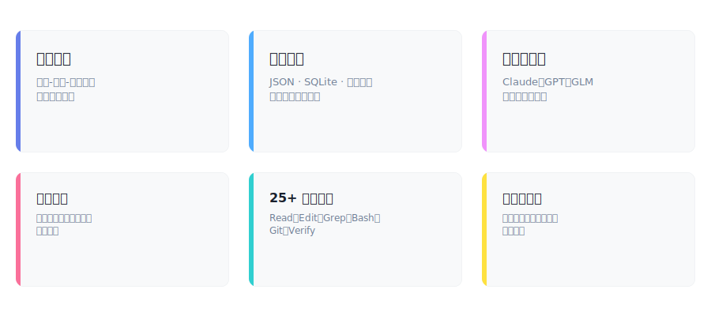

<div align="center">

# Prax

**驱动 LLM Agent 在真实代码库上执行 测试-验证-修复 循环的 CLI 工具**

<br>

[](LICENSE)
[](https://www.python.org/downloads/)

[快速开始](#快速开始) · [为什么选 Prax](#为什么选-prax) · [使用示例](#使用示例) · [基准测试](#基准测试) · [集成路径](#集成路径) · [配置](#配置) · [架构](#架构) · [参与贡献](#参与贡献)

<br>

</div>

---

## 快速开始

**目标**：装上 Prax，配好 AI key，跑通第一个任务 —— 5 分钟内。不需要编程背景。

> 你是老手？直接看文末 [老手一行命令](#老手一行命令)。

### Step 1 · 装前置依赖

Prax 需要 **Node.js**（CLI 外壳）+ **Python 3.10+**（运行时）。先看装没装：

```bash
node --version      # 应打印 v14 或更高
python3 --version   # 应打印 Python 3.10 或更高
```

缺一个？装上：

| 系统 | 安装命令 |
|---|---|
| **macOS** | `brew install node python@3.12`（没 Homebrew 先按 <https://brew.sh> 装）|
| **Linux** | `sudo apt install nodejs python3 python3-pip`（Debian/Ubuntu）或 `sudo dnf install nodejs python3`（Fedora）|
| **Windows** | 用 [WSL2](https://learn.microsoft.com/windows/wsl/install) 按 Linux 命令装。原生 Windows 暂不支持（0.5.x 路线图上） |

### Step 2 · 装 Prax

```bash
npm install -g praxagent
```

验证：

```bash
prax --version
```

**应该看到**：

```
prax 0.5.0
```

（0.5.0 或更高都行。）

**看到 `command not found`？**
- macOS 用 Homebrew 装的 Node：跑 `export PATH=/opt/homebrew/bin:$PATH`，加到 `~/.zshrc`
- Linux：确认 `npm prefix -g` 的 `bin/` 目录在 `$PATH` 上

### Step 3 · 给 Prax 接一个 LLM 服务

Prax 调用任何 LLM 都只需要两样东西：**接口地址（base_url）** 和 **API key**。
官方 API、中转代理、自建网关都用同一套配置流程。

1. 从你的服务面板拿到 `base_url` 和 key。

2. 设环境变量（变量名随便起，shell 里能 `export` 就行；`LLM_BASE_URL` / `LLM_API_KEY` 是我们推荐的命名）：

   ```bash
   export LLM_BASE_URL="https://你的服务地址"
   export LLM_API_KEY="你的 key"
   ```

3. 写 `~/.prax/models.yaml` 把它们串起来：

   ```bash
   mkdir -p ~/.prax
   cat > ~/.prax/models.yaml <<'YAML'
   providers:
     default:
       base_url_env: LLM_BASE_URL
       api_key_env: LLM_API_KEY
       format: openai          # 服务说 Anthropic 协议就改成 anthropic
       models:
         - name: <你的模型名>   # 服务面板/文档列出的精确模型 ID
   default_model: <你的模型名>
   YAML
   ```

   `<你的模型名>` 换成你服务实际暴露的 ID（跑服务的 `/v1/models` 端点或看面板列表）。

4. 验证：

   ```bash
   prax providers
   ```

   会列出你的 provider 名 + 模型名 + 状态。`LLM_API_KEY` 设好时状态显示 `available`；若是 `missing-credentials`，说明环境变量没传进 Prax——重跑 `export`，确认 `echo $LLM_API_KEY` 能回显 key。

### Step 4 · 第一个任务

```bash
mkdir -p ~/Desktop/prax-hello && cd ~/Desktop/prax-hello
prax prompt "你是谁？用一句话回答。"
```

**应该打印**类似：

```
我是 Prax 这个智能体运行时里跑的 AI 助手，可以帮你执行代码、测试和自动化任务。
```

✅ Prax 跑起来了。

### Step 5 · 让它真动文件（和普通 AI 聊天框的区别）

```bash
echo "hello world" > greeting.txt
prax prompt "读 greeting.txt 里的内容，然后把它改成全大写再写回去"
cat greeting.txt
```

**应该打印**：

```
HELLO WORLD
```

这就是 Prax 的核心能力——**读、写、跑测试、闭环验证**，不只是聊天。下面所有功能都建立在这之上。

**卡在某步了？** 常见问题：

| 症状 | 解决 |
|---|---|
| `Error: Model 'xxx' not found` | `~/.prax/models.yaml` 里的 `<你的模型名>` 和服务不匹配。看服务的 `/v1/models` 或面板取准确名字 |
| `HTTP 401 / Unauthorized` | key 打错或过期。重新生成再 `export LLM_API_KEY` |
| 静默退出没输出 | 端点不通。`curl -s "$LLM_BASE_URL"/...` 试一下，或换一个可用端点 |
| 中文乱码 | `export LANG=zh_CN.UTF-8` 加到 shell 配置 |

---

## 两种使用方式

跑通 Step 5 以后就可以选使用场景了。

### 方式 1 · 终端独立跑（你刚做的）

命令行直接用 Prax ——自动化、cron 定时、CI/CD 都走这条路，不用开 IDE。

```bash
prax prompt "跑 pytest -q，修第一个失败，跑通了就停"
prax prompt "读 README.md，给出 3 条具体改进建议"
prax cron add --name daily-news --schedule "0 17 * * *" --prompt "..."   # 定时任务
```

挑你的角色看端到端真实案例：

| 你的角色 | 教程 | 会搭出什么 |
|---|---|---|
| **PM / 客服主管** | [support-digest](./docs/tutorials/support-digest.md) | 每日工单 PII 脱敏简报，纯本地处理 |
| **内容创作者 / 知识库爱好者** | [ai-news-daily](./docs/tutorials/ai-news-daily.md) | 抓 X / 知乎 / Bilibili → 编译成 Obsidian wiki → 推简报 |
| **发版经理** | [release-notes](./docs/tutorials/release-notes.md) | git 历史 → CHANGELOG + 发布公告 |
| **DevEx / 技术写作** | [docs-audit](./docs/tutorials/docs-audit.md) | 每周"哪些文档没跟上代码"的 drift 报告 |
| **工程 Lead** | [pr-triage](./docs/tutorials/pr-triage.md) | 对 PR 真跑测试对比 base 分支 |

所有 5 个教程都自带示例数据——**不需要真 API / 真 PR** 就能跟着跑。

### 方式 2 · 集成到 Claude Code IDE

用 [Claude Code](https://claude.com/claude-code)，想在 IDE 里用 Prax 的 skill / 命令 / 验证 hook：

```bash
prax install --profile full
```

这会把 Prax 打包的 skill（4 个商用场景 + 1 个内容自动化流水线 + 4 个工程工作流）复制到 `~/.claude/`，注册 Prax 的 MCP server，并接入 hook 让 Claude Code 每次改代码时跑 Prax 的验证循环。

验证：

```bash
prax doctor --target claude
```

然后重开 Claude Code。你会看到新的 `/prax-status`、`/prax-doctor`、`/prax-plan`、`/prax-verify` 斜杠命令、`prax-planner` 这个 agent，以及自动应用的 Prax 规则。

撤销：`prax uninstall --target claude`。

> **说明**：`prax install` 当前只发 Claude Code 集成。Step 3 配好的 LLM 对所有使用方式（独立 CLI / IDE 集成）都通用。其他 IDE / CLI 宿主的 skill 导出在 0.5.x 路线图上。

### 老手一行命令

```bash
git clone https://github.com/ChanningLua/prax-agent.git && cd prax-agent
pip install -e .
export LLM_BASE_URL="https://你的服务地址"
export LLM_API_KEY="你的 key"
# 然后按 Step 3 写 ~/.prax/models.yaml
prax prompt "跑 pytest -q，修失败，跑通就停"
```

> Prax 可以代你执行 shell 命令。默认使用 `workspace-write` 模式——项目外的文件不可触碰。使用 `--permission-mode read-only` 可安全浏览。

---

## 为什么选 Prax

**Prax 不只是又一个 LLM 封装——它是为真实仓库工作打造的生产级 Agent 运行时。**

<p align="center">
  
</p>

### 验证优先架构

<p align="center">
  
</p>

大多数工具发送 prompt 然后听天由命。Prax 运行 **测试-验证-修复循环**：执行测试套件、分析失败、编辑代码、重新运行直到测试通过。验证层是一等公民——不是事后补丁。

**基准验证**: 10/10 仓库修复任务全部解决，平均 29.56 秒（对比同类框架基线 8/10）。

### 基于经验的自我改进

Prax 在会话和项目之间持续学习并自我改进：

- **纠错检测** — 自动检测用户纠正错误的信号（支持中英文），提取问题-方案模式并应用到后续会话
- **跨项目经验积累** — 在 `~/.prax/experiences.json` 构建全局经验库，提升所有仓库的工作效率
- **结构化错误恢复** — 将失败方案加入黑名单并尝试替代方案，避免同一会话内重复犯错
- **带置信度评分的持久记忆** — 两种后端（JSON/SQLite）追踪上下文、决策和学习到的模式
- **时序知识图谱** — 跟踪实体关系及其跨会话的演变
- **检查点/恢复** — 崩溃恢复确保长时间运行的任务不会丢失工作
- **轨迹记录** — 从执行历史中学习，识别成功模式并避免失败模式

这些能力已集成到核心运行时中——不是实验性插件。

### 使用经验与记忆

Prax 自动从你的工作中学习，并将知识应用到后续任务。以下是记忆系统的使用方式：

#### 自动学习

Prax 在以下场景捕获经验：

- **纠错检测** — 当你纠正错误时（如"不对"、"重新来"、"that's wrong"），Prax 提取问题-方案模式并保存到 `.prax/solutions/`
- **任务完成** — 置信度 ≥ 0.7 的事实被持久化到项目记忆
- **工具失败** — 失败的方案在会话内被加入黑名单，避免重复
- **验证成功** — 成功的测试-修复模式被记录为经验
- **会话结束** — 上下文快照被保存，供下次会话恢复

#### 查看记忆

查看 Prax 学到了什么：

```bash
# 项目级记忆
cat .prax/memory.json          # 事实和上下文（JSON 后端）
cat .prax/memory.db            # 或 SQLite 后端
ls .prax/solutions/            # 问题-方案模式

# 全局跨项目经验
cat ~/.prax/experiences.json   # 共享学习成果（JSON 后端）
cat ~/.prax/experiences.db     # 或 SQLite 后端

# 会话历史
ls .prax/sessions/             # 历史对话记录
```

#### 管理记忆

按需清理记忆：

```bash
# 清除项目记忆
rm -rf .prax/memory.json .prax/solutions/

# 清除全局经验
rm -rf ~/.prax/experiences.json

# 清除会话历史
rm -rf .prax/sessions/

# 完全重置
rm -rf .prax/ ~/.prax/
```

#### 记忆后端

Prax 支持两种记忆后端：

| 后端 | 存储 | 适用场景 | 搜索方式 |
|------|------|---------|---------|
| **local**（JSON） | `.prax/memory.json` + `~/.prax/experiences.json` | 零配置，小型项目 | 线性扫描 |
| **sqlite** | `.prax/memory.db` + `~/.prax/experiences.db` | 中大型项目，全文搜索 | FTS5 索引 |

在 `.prax/config.yaml` 中配置：

```yaml
memory:
  backend: local  # 或 sqlite
  local:
    max_facts: 100
    fact_confidence_threshold: 0.7
    max_experiences: 500
```

#### 置信度

- 置信度 ≥ **0.7** 的事实被持久化到记忆
- 低置信度的观察仅保留在会话上下文中

**双运行时路径** — 原生 CLI 用于自动化和 CI/CD，Claude Code 集成用于交互式开发。按需选择合适的工具。

**跨会话持久记忆** — 关闭终端不会丢失上下文。两种记忆后端：JSON（零配置）、SQLite（全文搜索）。

**多模型编排** — OpenAI 兼容、Anthropic 兼容及自定义协议的任意 LLM，具备显式路由、降级链和成本追踪。会话中随时切换模型 `/model <你的模型名>`。

**安全内建** — 权限模式（`read-only`、`workspace-write`、`danger-full-access`）、Schema 校验、工作区边界、完整审计追踪。

**为真实代码库而生** — 25+ 内置工具、中间件管线（循环检测、质量门禁）、多语言支持、交互式 REPL 模式。

**透明可度量** — 实时成本追踪、会话历史与回放、内置基准测试套件、开放架构可扩展自定义组件。

---

## 使用示例

### 仓库修复

```
$ prax "run pytest -q, fix the failure, and stop when tests pass"
▶ VerifyCommand {"command": "pytest -q"}
  ✗ FAILED test_auth.py::test_login - AssertionError
▶ Read {"file_path": "src/auth.py"}
▶ Edit {"file_path": "src/auth.py", ...}
▶ VerifyCommand {"command": "pytest -q"}
  ✓ 1 passed in 0.12s
Verification passed. Task complete.
```

### 一次性任务

```bash
prax "explain the authentication flow in login.py"
prax "refactor auth.py error handling, replace requests with httpx"
prax "analyze project architecture, list technical debt, prioritize by impact"
```

### 交互式 REPL

```bash
prax repl

> analyze the codebase structure
> fix the SQL injection in user_query.py
> /model <你的模型名>
> /cost
Session: 12.4K tokens ($0.04)
```

### 斜杠命令

```
/model, /session list, /plan, /todo show, /doctor, /cost, /help
```

---

## 基准测试

<p align="center">
  
</p>

Prax 在仓库修复任务上达到 **10/10 成功率**，平均完成时间 **29.56 秒** — 比跨框架基线快 49%。

| 指标 | Prax | 框架基线 | 提升 |
|------|------|---------|------|
| 成功率 | **10/10** (100%) | 8/10 (80%) | **+25%** |
| 平均耗时 | **29.56s** | 58.44s | **-49%** |
| 超时次数 | **0** | 2 | **-100%** |

**驱动因素：**
- **验证优先架构** — 测试-验证-修复循环及早捕获错误
- **质量门禁中间件** — 循环检测与收敛引导
- **智能沙箱降级** — 验证命令绕过不必要的开销

基准方法论：在真实仓库修复任务上运行 10 轮，保留会话状态。详见 [docs/BENCHMARKS.md](./docs/BENCHMARKS.md)。

---

## 集成路径

Prax 提供两种运行路径——按需选择：

| 特性 | 原生运行时 | Claude Code 集成 |
|------|-----------|-----------------|
| 执行方式 | CLI 命令 | Claude Code IDE |
| 交互方式 | 命令行 REPL | IDE 对话界面 |
| 上下文管理 | 本地 JSON/SQLite | Claude Code 会话 |
| 工具集成 | 25+ 内置工具 | Claude Code 工具 + Prax 扩展 |
| 适用场景 | 自动化、CI/CD | 交互式开发、代码审查 |

### Claude Code 集成优势

- **IDE 原生体验** — 在 Claude Code 中直接使用 Prax 能力
- **深度集成** — 通过 MCP Server 和 Hooks 实现深度集成
- **安全防护** — 写入前密钥扫描、提交前质量检查
- **会话持久化** — 自动保存会话状态，支持断点恢复
- **双向协作** — Claude Code 的对话能力 + Prax 的验证循环

<p align="center">
  
</p>

> 安装步骤参见上方的 [方式 2 · 集成到 Claude Code IDE](#方式-2--集成到-claude-code-ide)（`prax install --profile full` + `prax doctor --target claude`）。

---

## 配置

**模型** — 在项目中创建 `.prax/models.yaml`（或编辑快速开始 Step 3 用过的全局 `~/.prax/models.yaml`）：

```yaml
default_model: <你的模型名>

providers:
  default:
    base_url_env: LLM_BASE_URL    # 任意环境变量名，在 Step 3 已声明
    api_key_env: LLM_API_KEY
    format: openai                # 端点说 Anthropic 协议就改成 anthropic
    models:
      - name: <你的模型名>         # 服务暴露的精确模型 ID
```

如果要同时接多个端点（例如 OpenAI 兼容 + Anthropic 兼容各一个），再加一项 `providers:` 条目，分别填各自的 `base_url_env` / `api_key_env` 和模型列表即可。每个 provider 也可以直接写死 `base_url`（不走 env），完整 schema 见 `core/llm_client.py`。

**权限模式**

| 模式 | 允许的操作 | 默认 |
|------|-----------|------|
| `read-only` | 不可写文件，不可执行 shell 命令 | |
| `workspace-write` | 可修改项目内的文件 | ✓ |
| `danger-full-access` | 无限制 | |

```bash
prax --permission-mode read-only "analyze security vulnerabilities"
```

**运行时路径**

| 参数 | 行为 |
|------|------|
| `--runtime-path auto` | 如果安装了 `claude` 则使用 Claude CLI 桥接，否则使用原生运行时（默认） |
| `--runtime-path native` | 始终使用原生运行时 |
| `--runtime-path bridge` | 始终使用 Claude CLI 桥接；未安装 `claude` 时报错 |

**数据目录**

| 路径 | 内容 |
|------|------|
| `.prax/sessions/` | 对话历史 |
| `.prax/memory.json` | 项目记忆（自动提取的事实，JSON 后端） |
| `.prax/memory.db` | 项目记忆（SQLite 后端） |
| `.prax/solutions/` | 纠错检测生成的问题-方案模式 |
| `.prax/todos.json` | 当前任务列表 |
| `.prax/agents/` | 自定义 Agent 定义 |
| `.prax/models.yaml` | 模型配置 |
| `.prax/config.yaml` | 项目级配置（记忆后端等） |
| `~/.prax/` | 全局配置（跨项目） |
| `~/.prax/experiences.json` | 全局跨项目经验（JSON 后端） |
| `~/.prax/experiences.db` | 全局跨项目经验（SQLite 后端） |
| `~/.prax/config.yaml` | 用户级配置 |

---

## 架构

<p align="center">
  
</p>

核心模块：

| 路径 | 职责 |
|------|------|
| `core/agent_loop.py` | 核心编排循环（最多 25 次迭代，熔断器） |
| `core/middleware.py` | VerificationGuidance、LoopDetection、QualityGate 等 |
| `tools/verify_command.py` | 有界验证（pytest、npm test、cargo test、go test） |
| `tools/sandbox_bash.py` | 自动降级：验证命令绕过沙箱开销 |
| `core/memory/` | 可插拔后端（JSON / SQLite） |
| `core/llm_client.py` | Provider 注册表，多模型路由 |
| `agents/` | Ralph（规划者）、Sisyphus（执行者）、Team（并行） |
| `workflows/` | 任务分解与编排 |

---

## 参与贡献

欢迎贡献！详见 [CONTRIBUTING.md](CONTRIBUTING.md)：
- 开发环境搭建
- 代码风格规范
- 测试要求
- PR 流程

基准测试和可复现性相关工作，另见 [docs/BENCHMARKS.md](./docs/BENCHMARKS.md)。

---

## 许可证

MIT License — 详见 [LICENSE](LICENSE)。
